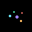
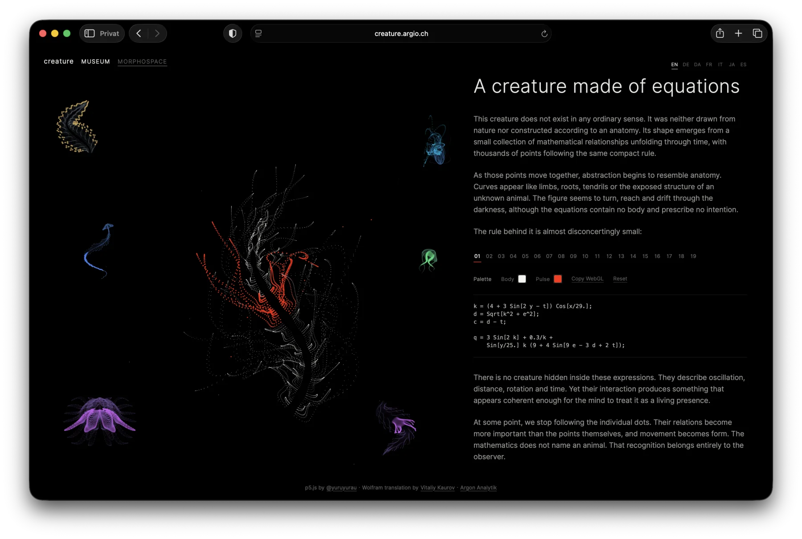
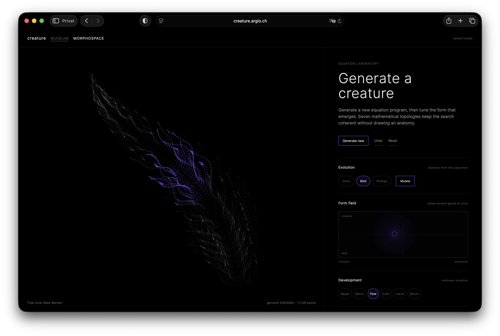

<div align="center">
  
  <h1>creature</h1>
  <p><strong>A browser-native museum of equations and an experimental morphospace for generating new mathematical organisms.</strong></p>

  <p>
    <a href="https://creature.argio.ch/"></a>
    <a href="https://creature.argio.ch/morphospace/"></a>
    <a href="https://github.com/argon-analytik/creature/actions/workflows/ci.yml"></a>
    <a href="LICENSE"></a>
  </p>

  <p>
    
    
    
    
  </p>
</div>

## Museum

Nineteen compact point equations unfold into moving forms that seem biological without describing an anatomy. The museum evaluates those equations live in WebGL, preserves their original coordinate systems, and adds a travelling colour pulse, a restrained spatial drift, multilingual editorial context, and per-exhibit palettes.

[](https://creature.argio.ch/)

## Morphospace

Morphospace is an equation laboratory for creating new specimens. It combines seven coherent mathematical topologies with bounded mutation, developmental operators, a two-dimensional form field, live framing, colour controls, and editable code. Each specimen can be inspected as compact mathematical notation, p5.js, or editable WebGL.

[](https://creature.argio.ch/morphospace/)

## What you can do

- Explore 19 curated mathematical creatures and their source equations.
- Change body and pulse colours without altering an exhibit's original form.
- Open an exhibit as an editable Morphospace specimen.
- Generate, mutate, undo, reset, and locally preserve new equation programs.
- Shape several genes at once through the form field.
- Apply nonlinear developmental operations such as ripple, mirror, flow, echo, carve, and bloom.
- Edit and apply the bounded WebGL program while the rendered creature remains visible.
- Copy compact notation, p5.js, and WebGL representations for further study.

## Quick start

```bash
git clone https://github.com/argon-analytik/creature.git
cd creature
npm install
npm run dev
```

Open the URL printed by Vite, usually <http://127.0.0.1:5173/>. Morphospace is available at <http://127.0.0.1:5173/morphospace/>.

```bash
npm test
npm run build
```

## How it works

The renderer does not animate a stored mesh or sequence of images. A WebGL 2 vertex shader evaluates thousands of points from a compact equation program for every frame. Time changes the mathematical relationships; the collective motion creates the apparent organism.

The museum keeps each source equation stable. Morphospace works on a separate, editable representation so experimentation never mutates the curated exhibits. Generated specimens pass through bounded validation and quantile-based live framing before they are shown.

See [Architecture](docs/ARCHITECTURE.md) for the rendering, state, translation, and validation model.

## Project structure

```text
creature/
├── index.html              # Museum
├── morphospace/            # Equation laboratory
├── src/                    # Rendering, catalogue, generator, i18n, tests
├── public/                 # Fonts, social previews, crawler metadata
├── docs/                   # Public architecture and images
└── .github/workflows/      # Automated checks
```

## Languages

The museum and Morphospace are available in English, German, Danish, French, Italian, Japanese, and Spanish. The first supported browser language is selected automatically, with English as the fallback.

## Contributing

Ideas, bug reports, new mathematical families, rendering improvements, translations, and carefully scoped pull requests are welcome. Start with [CONTRIBUTING.md](CONTRIBUTING.md) and keep new generators bounded, reproducible, and visibly distinct from the curated source exhibits.

## Attribution

The project began with the compact p5.js equation sketches by [@yuruyurau](https://x.com/yuruyurau/status/1933629116575855091) and the [Wolfram Language adaptation by Vitaliy Kaurov](https://community.wolfram.com/groups/-/m/t/3529968). Their work remains credited in the interface and in [THIRD_PARTY_NOTICES.md](THIRD_PARTY_NOTICES.md).

## License

Original software in this repository is available under the [MIT License](LICENSE). Source equations, referenced posts, fonts, names, and other third-party material remain subject to their respective notices and terms. See [THIRD_PARTY_NOTICES.md](THIRD_PARTY_NOTICES.md).
